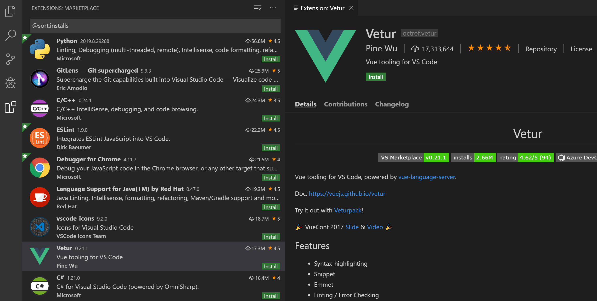

# SE-Assignment-5
Installation and Navigation of Visual Studio Code (VS Code)
 Instructions:
Answer the following questions based on your understanding of the installation and navigation of Visual Studio Code (VS Code). Provide detailed explanations and examples where appropriate.

 Questions:

1. Installation of VS Code:
   - Describe the steps to download and install Visual Studio Code on Windows 11 operating system. Include any prerequisites that might be needed.
->Requirements for Visual Studio Code
Hardware
Visual Studio Code is a small download (< 200 MB) and has a disk footprint of < 500 MB. VS Code is lightweight and should easily run on today's hardware.

VS code recommends:

1.6 GHz or faster processor
1 GB of RAM
Platforms
VS Code is supported on the following platforms:

Windows 10 and 11 (64-bit)
macOS versions with Apple security update support. This is typically the latest release and the two previous versions.
Linux (Debian): Ubuntu Desktop 20.04, Debian 10
Linux (Red Hat): Red Hat Enterprise Linux 8, Fedora 36
Not supported
VS Code does not support application virtualization solutions such as Microsoft App-V or MSIX for Windows, or third-party app virtualization technologies.
Running VS Code in a virtual machine environment requires a full operating system.
VS Code does not support multiple simultaneous users using the software on the same machine, including shared virtual desktop infrastructure machines or a pooled Windows/Linux Virtual Desktop host pool.
Running the full VS Code in Windows/Linux containers is not supported but running with the Dev Containers extension is supported. When using the Dev Containers extension, the VS Code server is running in the container while the VS Code client is on the desktop.
Additional Linux requirements
GLIBCXX version 3.4.25 or later
GLIBC version 2.28 or later

"""Initial Set up Steps"""
->Installation
   ()Download the Visual Studio Code installer for Windows.
   ()Once it is downloaded, run the installer (VSCodeUserSetup-{version}.  exe). This will only take a minute.
  () By default, VS Code is installed under C:\Users\{Username}\AppData\Local\Programs\Microsoft VS Code.
   ()Alternatively, you can also download a Zip archive, extract it and run Code from there.

2. First-time Setup:
   - After installing VS Code, what initial configurations and settings should be adjusted for an optimal coding environment? Mention any important settings or extensions.
->Extensions
   ()VS Code extensions let third parties add support for additional:

   ()Languages - C++, C#, Go, Java, Python
   ()Tools - ESLint, JSHint , PowerShell
   ()Debuggers - PHP XDebug.
   ()Keymaps - Vim, Sublime Text, IntelliJ, Emacs, Atom, Brackets, Visual  Studio, Eclipse
   ()Extensions integrate into VS Code's UI, commands, and task running systems so you'll find it easy to work with different technologies through VS Code's shared interface.
3. User Interface Overview:
   - Explain the main components of the VS Code user interface. Identify and describe the purpose of the Activity Bar, Side Bar, Editor Group, and Status Bar.
   VS Code comes with a simple and intuitive layout that maximizes the space provided for the editor, while leaving ample room to browse and access the full context of your folder or project. The user interface is divided into five main areas:

   ()Editor - The main area to edit your files. You can open as many editors as you like side by side vertically and horizontally.
   ()Primary Side Bar - Contains different views like the Explorer to assist you while working on your project.
   ()Status Bar - Information about the opened project and the files you edit.
   ()Activity Bar - Located on the far left-hand side. Lets you switch between views and gives you additional context-specific indicators, like the number of outgoing changes when Git is enabled. You can change the position of the Activity Bar.
   ()Panel - An additional space for views below the editor region. By default, it contains output, debug information, errors and warnings, and an integrated terminal. The Panel can also be moved to the left or right for more vertical space.
   ()Tip: A Secondary Side Bar is also available to display views opposite the Primary Side Bar. You can show it with Ctrl+Alt+B and drag a view from the Primary Side Bar to the Secondary Side Bar.
4. Command Palette:
   - What is the Command Palette in VS Code, and how can it be accessed? Provide examples of common tasks that can be performed using the Command Palette.
-> The  Command Pallete is accessed via pressing a command of Ctrl+Shift+P

   ()The Command Palette provides access to many commands. You can run editor commands, open files, search for symbols, and see a quick outline of a file, all using the same interactive window. Here are a few tips:

   ->Ctrl+P enables you to navigate to any file or symbol by typing its name
   ->Ctrl+Tab cycles you through the last set of files opened
   ->Ctrl+Shift+P brings you directly to the editor commands
   ->Ctrl+Shift+O enables you to navigate to a specific symbol in a file
   ->Ctrl+G enables you to navigate to a specific line in a file
5. Extensions in VS Code:
   - Discuss the role of extensions in VS Code. How can users find, install, and manage extensions? Provide examples of essential extensions for web development.
   ->Extensions in VS Code:
   Extensions play a vital role in VS Code as they provide additional functionality to the editor. They can:
   - Add support for new languages
   - Integrate development tools
   - Provide additional features
   The extensions are found on the Visual Studio Code Marketplace
   You can browse and install extensions from within VS Code. Bring up the Extensions view by clicking on the Extensions icon in the Activity Bar on the side of VS Code or the View: Extensions command (Ctrl+Shift+X).
This will show you a list of the most popular VS Code extensions on the VS Code Marketplace.

To install an extension, select the Install button. Once the installation is complete, the Install button will change to the Manage gear button.
Essential extensions for web development include:
- Live Server: Allows you to serve your HTML, CSS, and JavaScript files directly from VS
- Debugger for Chrome: Enables you to debug your JavaScript code in the Chrome browser
- ESLint: Provides real-time feedback on your JavaScript code quality
- Prettier: Formats your code according to a set of rules
- HTML Snippets: Provides HTML code snippets for faster development

6. Integrated Terminal:
   - Describe how to open and use the integrated terminal in VS Code. What are the advantages of using the integrated terminal compared to an external terminal?
You can open a terminal as follows:

   ->From the menu, use the Terminal > New Terminal or View > Terminal menu commands.
   ->From the Command Palette (Ctrl+Shift+P), use the View: Toggle Terminal command.
   ->In the Explorer, you can use the Open in Integrated Terminal context menu command to open a new terminal from a folder.
   ->To toggle the terminal panel, use the Ctrl+` keyboard shortcut.
   ->To create a new terminal, use the Ctrl+Shift+` keyboard shortcut.
   ->VS Code's terminal has additional functionality called shell integration that tracks where commands are run with decorations on the left of a command and in the scrollbar:
   
Advantages of using the integrated terminal compared to an external terminal:
   ()Seamless Integration: The integrated terminal is tightly integrated with the VS Code interface, allowing you to quickly access and use it without having to switch between applications. This can increase your productivity and streamline your development workflow.
   ()Context Switching: When you're working on a project in VS Code, the integrated terminal automatically changes its working directory to match the current folder or workspace. This reduces the need to manually navigate to the correct directory in your external terminal.
   ()Multi-Tab Support: The integrated terminal in VS Code supports multiple tabs, allowing you to switch between different terminal sessions within the same window. This can be useful when working on multiple tasks or projects simultaneously.
7. File and Folder Management:
   - Explain how to create, open, and manage files and folders in VS Code. How can users navigate between different files and directories efficiently?
      ->Creating Files and Folders:You can create a new file or folder in VS Code by using the File  > New File or File > New Folder menu commands. Alternatively, you can use the Explorer view and right-click on a folder to create a new file or folder.
      ->Opening Files and Folders:You can open a file or folder in VS Code by using the File > Open File or File > Open Folder menu commands. Alternatively, you can drag and drop files or folders into the VS Code window.
      ->Managing Files and Folders:You can manage files and folders in VS Code using the Explorer view. The Explorer view provides a hierarchical view of your files and folders, allowing
      you to easily navigate and manage your project structure.
      ->Navigating Between Files and Directories:  You can navigate between different files and directories efficiently in VS
      Code using the following methods:
         ->Breadcrumbs: The breadcrumbs navigation bar at the top of the VS Code window allows you to quickly navigate between different files and directories.
         ->Explorer View: The Explorer view provides a hierarchical view of your files and folders, allowing you to easily navigate and manage your project structure.
         ->File Navigation: You can use the Ctrl+P keyboard shortcut to open the File Navigation panel, which allows you to quickly search and navigate to different files in your project.
         ->Folder Navigation: You can use the Ctrl+Shift+E keyboard shortcut to open the Folder Navigation panel, which allows you to quickly navigate to different folders in your project.

8. Settings and Preferences:
   - Where can users find and customize settings in VS Code? Provide examples of how to change the theme, font size, and keybindings.
   Use the Settings editor to review and change VS Code settings. To open the Settings editor, navigate to File > Preferences > Settings. Alternately, open the Settings editor from the Command Palette (Ctrl+Shift+P) with Preferences: Open Settings or use the keyboard shortcut (Ctrl+,).
   When you open the Settings editor, you can search and discover the settings you are looking for. When you search using the search bar, it not only shows and highlights the settings matching your criteria, but also filter out those which are not matching. This makes finding settings quick and easy.
 Examples of how to change settings:
 - Change the theme: Search for "theme" in the Settings editor and select a theme fromthe dropdown list.
 - Change the font size: Search for "editor.fontSize" in the Settings editor and enter a new value.
 - Change keybindings: Search for "keybindings" in the Settings editor and click on the pencil icon next to the keybinding you want to change. Enter a new keybinding and press Enter to save the changes.

9. Debugging in VS Code:
   - Outline the steps to set up and start debugging a simple program in VS Code. What are some key debugging features available in VS Code?
One of the key features of Visual Studio Code is its great debugging support. VS Code's built-in debugger helps accelerate your edit, compile, and debug loop.
VS Code has built-in debugging support for the Node.js runtime and can debug JavaScript, TypeScript, or any other language that gets transpiled to JavaScript.

For debugging other languages and runtimes (including PHP, Ruby, Go, C#, Python, C++, PowerShell and many others), look for Debuggers extensions in the VS Code Marketplace or select Install Additional Debuggers in the top-level Run menu.
Here are the steps to set up and start debugging a simple program(in this case a node.js) in VS Code:
To bring up the Run and Debug view, select the Run and Debug icon in the Activity Bar on the side of VS Code. You can also use the keyboard shortcut Ctrl+Shift+D.The Run and Debug view displays all information related to running and debugging and has a top bar with debugging commands and configuration settings.

To run or debug a simple app in VS Code, select Run and Debug on the Debug start view or press F5 and VS Code will try to run your currently active file.

However, for most debugging scenarios, creating a launch configuration file is beneficial because it allows you to configure and save debugging setup details. VS Code keeps debugging configuration information in a launch.json file located in a .vscode folder in your workspace (project root folder) or in your user settings or workspace settings.

To create a launch.json file, select create a launch.json file in the Run start view.
VS Code will try to automatically detect your debug environment, but if this fails, you will have to choose it manually:
If you go back to the File Explorer view (Ctrl+Shift+E), you'll see that VS Code has created a .vscode folder and added the launch.json file to your workspace.
Note that the attributes available in launch configurations vary from debugger to debugger. You can use IntelliSense suggestions (Ctrl+Space) to find out which attributes exist for a specific debugger. Hover help is also available for all attributes.

Do not assume that an attribute that is available for one debugger automatically works for other debuggers too. If you see red squiggles in your launch configuration, hover over them to learn what the problem is and try to fix them before launching a debug session.

10. Using Source Control:
    - How can users integrate Git with VS Code for version control? Describe the process of initializing a repository, making commits, and pushing changes to GitHub.
    Visual Studio Code has integrated source control management (SCM) and includes Git support out-of-the-box thus so long as you have git installed on your system,you are good to go.
    One can initialize a repository on Vs code using git by:
    - Opening the folder you want to initialize as a Git repository in VS Code.
    - Opening the Command Palette in VS Code by pressing Ctrl+Shift+P (Windows/Linux)
    - Typing "Git: Initialize Repository" in the Command Palette and selecting the command.
    - VS Code will then create a new .git folder in your workspace.
    - You can then stage and commit your changes using the Git panel in VS Code.
    One can making commits and push changes by:
    - Opening the Git panel in VS Code by clicking on the Git icon in the left sidebar or
    - Pressing Ctrl+Shift+G (Windows/Linux) to toggle the Git panel.
    - Staging changes by clicking the "+" icon next to the files you want to stage.
    - Writing a commit message in the input field at the top of the Git panel.
    - Clicking the "Commit" button or pressing Ctrl+Enter (Windows/Linux) to commit
    - Clicking the "..." button in the top right corner of the Git panel and selecting "
    - Push to..." to push your changes to a remote repository like GitHub.
    - You can also use the Command Palette to run Git commands. For example, you can type "Git: Push" to push your changes to a remote repository.
    - You can also use the GitLens extension which provides a lot of features for Git integration.
    - You can also use the GitHub Pull Requests and Issues extension which allows you to manage pull requests and issues directly from VS Code.
   
References mostly include:
-> VS code official documentation on:https://code.visualstudio.com/docs/editor/editingevolved
->Claudde Sonnet and Blackbox Ai
 Submission Guidelines:
- Your answers should be well-structured, concise, and to the point.
- Provide screenshots or step-by-step instructions where applicable.
- Cite any references or sources you use in your answers.
- Submit your completed assignment by 1st July 

